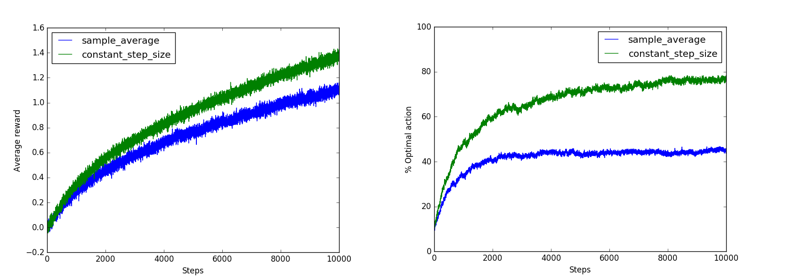
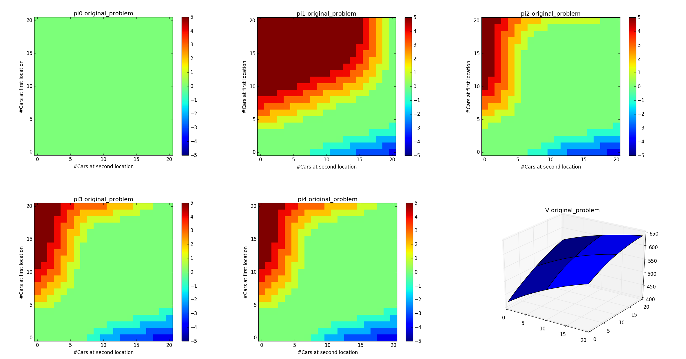
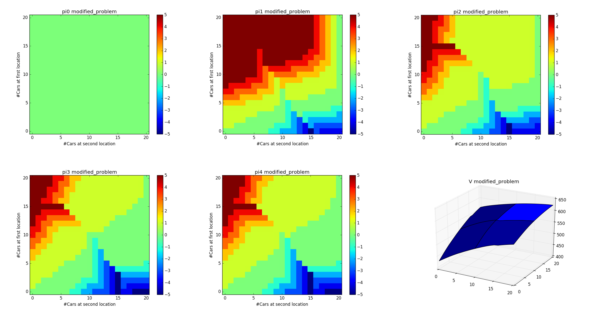
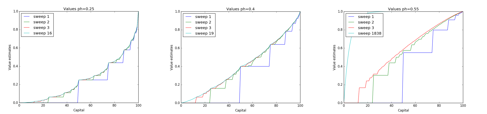
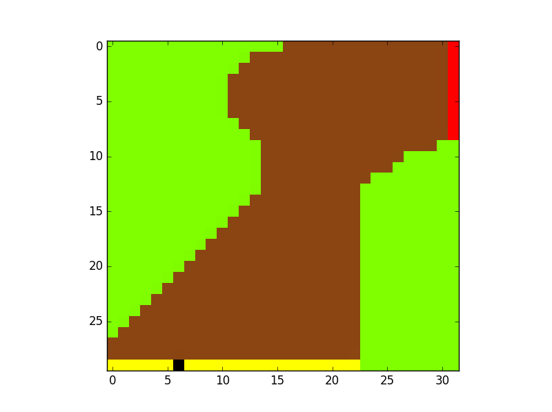

# Solutions to Programming Exercises for "Reinforcement Learning: An Introduction (2nd Edition)"

## About
Implementations for solutions to programming exercises of [*Reinforcement Learning: An Introduction, Second Edition (Sutton &amp; Barto)*](http://incompleteideas.net/book/the-book-2nd.html)

## Table of Contents
- [Reinforcement Learning: An Introduction - solutions](#solutions-to-programming-exercises-for-reinforcement-learning-an-introduction-2nd-edition)
  * [About](#about)
  * [Table of Contents](#table-of-contents)
  * [Implementations](#implementations)
    + [Exercise 2.5](#exercise-25)
    + [Exercise 2.11](#exercise-211)
    + [Exercise 4.7](#exercise-47)
    + [Exercise 4.9](#exercise-49)
    + [Exercise 5.10](#exercise-510)
    + [Exercise 8.4](#exercise-84)

## Implementations   
### Exercise 2.5
Implementation of the solution of Exercise 2.5

[Code](exercises/Exercise2.5-2.11.py)

### Exercise 2.11
Implementation of the solution of Exercise 2.11

[Code](exercises/Exercise2.5-2.11.py)

### Exercise 4.7
Implementation of the solution of Exercise 4.7

[Code](exercises/Exercise4.7.py)

Original problem

Modified problem

### Exercise 4.9
Implementation of the solution of Exercise 4.9

[Code](exercises/Exercise4.9.py)

### Exercise 5.10
Implementation of the solution of Exercise 5.10

[Code](exercises/Exercise5.10.py)

### Exercise 8.4
Implementation of the solution of Exercise 8.4

[Code](exercises/Exercise8.4.py)
